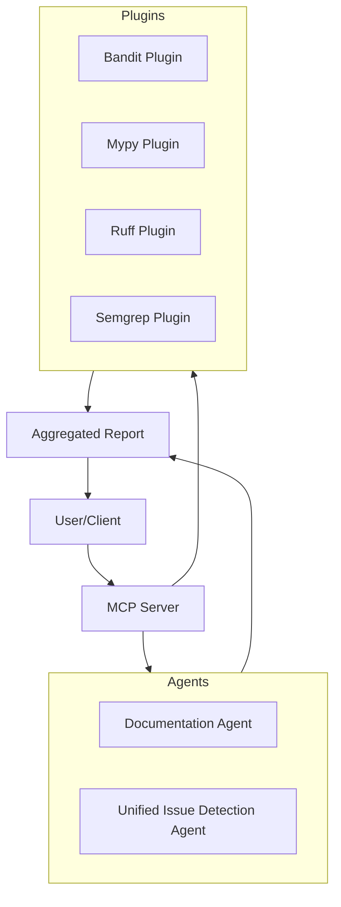

# Multi-Agent MCP Server

[](https://opensource.org/licenses/MIT)
[](https://www.python.org/downloads/)
[](https://modelcontextprotocol.io/)
[](https://smithery.ai/)

A production-ready, modular multi-agent MCP server for automated codebase review and documentation generation. Built with the Model Context Protocol (MCP) for seamless integration with AI development workflows and compatible with Smithery for easy deployment.

## 🚀 Features

- **🤖 Multi-Agent Architecture**: Specialized AI agents for different analysis types
  - **Debt Agent**: Technical debt and maintainability analysis
  - **Improvement Agent**: Code quality improvement recommendations
  - **Critical Agent**: Security vulnerabilities and reliability issues
  - **Documentation Agent**: Comprehensive project documentation generation
- **📡 MCP Integration**: Full Model Context Protocol support for AI tool integration
- **🔀 Workflow Orchestration**: Advanced DSPy workflow integration for intelligent analysis
- **✅ Strict Validation**: Comprehensive output validation with Pydantic schemas
- **🏭 Production Ready**: Comprehensive testing, logging, and professional packaging
- **☁️ Smithery Compatible**: Ready for deployment on Smithery platform
- **⚡ Flexible Execution**: Quick scan for fast analysis or deep scan with LLM integration

## 📋 Table of Contents

- [Installation](#installation)
- [Quick Start](#quick-start)
- [MCP Tools Reference](#mcp-tools-reference)
- [Smithery Integration](#smithery-integration)
- [Configuration](#configuration)
- [API Documentation](#api-documentation)
- [Development](#development)
- [Contributing](#contributing)
- [License](#license)

## 🛠️ Installation

### Via Smithery (Recommended)

The easiest way to use this MCP server is through [Smithery](https://smithery.ai/):

1. Visit [Smithery](https://smithery.ai/)
2. Search for "multi-agent-code-review"
3. Add to your AI workflow with one click

### Python Package

```bash
# Using uv (recommended)
uv add multiagent-mcp-server

# Using pip
pip install multiagent-mcp-server

# Using conda
conda install -c conda-forge multiagent-mcp-server
```

### From Source

```bash
# Clone the repository
git clone https://github.com/Arpit-Moga/Vibechecker.git
cd Vibechecker

# Install with uv (recommended)
uv sync

# Or with pip
pip install -e .
```

## 🚀 Quick Start

### As MCP Server

```bash
# Run the MCP server
python -m multiagent_mcp_server

# Or using the installed script
multiagent-mcp-server
```

### MCP Client Configuration

Add to your MCP client configuration (e.g., Claude Desktop, Continue, etc.):

```json
{
  "mcpServers": {
    "multi-agent-code-review": {
      "command": "python",
      "args": ["-m", "multiagent_mcp_server"],
      "env": {
        "CODE_DIRECTORY": "./",
        "LOG_LEVEL": "INFO"
      }
    }
  }
}
```

### With Environment Variables

```bash
# Set API keys for LLM analysis (optional for quick mode)
export GOOGLE_API_KEY="your-google-api-key"
export OPENAI_API_KEY="your-openai-api-key"

# Configure analysis settings
export CODE_DIRECTORY="/path/to/your/project"
export MAX_FILE_SIZE_MB="10.0"
export LOG_LEVEL="INFO"

# Run the server
python -m multiagent_mcp_server
```

## 🔧 MCP Tools Reference

The server provides the following MCP tools for AI agents:

### `issue_detection_review`
Runs unified issue detection analysis on the specified code directory.

**Parameters:**
- `code_directory` (string, optional): Path to analyze (default: current directory)
- `output_directory` (string, optional): Output path (default: ./DOCUMENTATION)
- `output_format` (enum): "md" or "json" (default: "md")
- `scan_mode` (enum): "quick" or "deep" (default: "quick")

**Example:**
```json
{
  "tool": "issue_detection_review",
  "arguments": {
    "code_directory": "./src",
    "scan_mode": "deep",
    "output_format": "json"
  }
}
```

### `documentation_generate`
Generates comprehensive project documentation.

**Parameters:**
- `code_directory` (string, optional): Path to analyze
- `output_directory` (string, optional): Output path

### `comprehensive_review`
Runs all analyses in a coordinated workflow for complete project review.

**Parameters:** Same as `issue_detection_review`

## ☁️ Smithery Integration

This MCP server is fully compatible with [Smithery](https://smithery.ai/), providing:

- **Easy Deployment**: One-click deployment to Smithery cloud
- **Automatic Discovery**: Server is automatically indexed in Smithery registry
- **Configuration Schema**: Full JSON schema validation for parameters
- **HTTP Transport**: Optional HTTP endpoint for remote access
- **Security Scanning**: Passes Smithery security validation

### Smithery Configuration

The server includes a `smithery.yaml` configuration file that defines:
- Server metadata and capabilities
- Connection methods (stdio and HTTP)
- Tool schemas and validation
- Security settings

### Publishing to Smithery

1. Ensure your code is in a public GitHub repository
2. Add proper tags and description in `smithery.yaml`
3. Smithery will automatically discover and index your server
4. Users can then find and use your server through the Smithery platform

## ⚙️ Configuration

### Environment Variables

| Variable | Description | Default |
|----------|-------------|---------|
| `CODE_DIRECTORY` | Default directory to analyze | `.` |
| `GOOGLE_API_KEY` | Google AI API key for LLM analysis | None |
| `OPENAI_API_KEY` | OpenAI API key for LLM analysis | None |
| `MAX_FILE_SIZE_MB` | Maximum file size to process | `5.0` |
| `MAX_FILES_TO_PROCESS` | Maximum number of files | `100` |
| `LOG_LEVEL` | Logging level | `INFO` |

### Scan Modes

- **Quick Mode**: Fast static analysis using linting tools (ruff, bandit, mypy)
- **Deep Mode**: Comprehensive analysis including LLM-powered review

### Output Formats

- **Markdown**: Human-readable reports with formatting
- **JSON**: Structured data for programmatic consumption

## 📚 API Documentation

### Response Format

All tools return a consistent response structure:

```typescript
interface AgentReport {
  issues: IssueOutput[];
  review: string;
  total_issues?: number;
  high_severity_count?: number;
  documentation_files?: number;
  error?: boolean;
}

interface IssueOutput {
  type: "maintainability" | "security" | "performance" | "compliance" | "other";
  severity: "low" | "medium" | "high";
  description: string;
  file: string;
  line: number;
  suggestion?: string;        // For maintainability/performance
  remediation?: string;       // For security/compliance
  reference?: string;
}
```

### Error Handling

The server implements comprehensive error handling:
- Input validation with detailed error messages
- Graceful degradation when tools are unavailable
- Structured error responses with error codes
- Comprehensive logging for debugging

## 🧪 Development

### Prerequisites

- Python 3.10+
- uv package manager (recommended) or pip

### Setup Development Environment

```bash
# Clone the repository
git clone https://github.com/Arpit-Moga/Vibechecker.git
cd Vibechecker

# Install development dependencies
uv sync --dev

# Install pre-commit hooks
pre-commit install
```

### Running Tests

```bash
# Run all tests
pytest

# Run with coverage
pytest --cov=multiagent_mcp_server

# Run specific test file
pytest tests/test_models.py -v
```

### Code Quality

```bash
# Format code
black src tests
isort src tests

# Lint code
flake8 src tests
mypy src

# Security scan
bandit -r src
```

### Project Structure

```
multiagent-mcp-server/
├── src/multiagent_mcp_server/    # Main package
│   ├── __init__.py               # Package exports
│   ├── __main__.py               # Module entry point
│   ├── server.py                 # MCP server implementation
│   ├── models.py                 # Pydantic models
│   ├── config.py                 # Configuration management
│   ├── base_agent.py             # Base agent class
│   ├── issue_detection_agent.py  # Issue detection logic
│   ├── documentation_agent.py    # Documentation generation
│   └── ...                       # Other modules
├── tests/                        # Test suite
├── docs/                         # Documentation
├── smithery.yaml                 # Smithery configuration
├── mcp.json                      # MCP manifest
├── pyproject.toml                # Package configuration
└── README.md                     # This file
```

## 🤝 Contributing

We welcome contributions! Please see our [Contributing Guide](CONTRIBUTING.md) for details.

### Quick Contribution Steps

1. Fork the repository
2. Create a feature branch (`git checkout -b feature/amazing-feature`)
3. Make your changes
4. Add tests for new functionality
5. Ensure all tests pass (`pytest`)
6. Commit your changes (`git commit -m 'Add amazing feature'`)
7. Push to the branch (`git push origin feature/amazing-feature`)
8. Open a Pull Request

### Development Guidelines

- Follow PEP 8 style guidelines
- Add type hints to all functions
- Write comprehensive tests for new features
- Update documentation as needed
- Ensure backwards compatibility

## 📄 License

This project is licensed under the MIT License - see the [LICENSE](LICENSE) file for details.

## 🙏 Acknowledgments

- [Model Context Protocol](https://modelcontextprotocol.io/) for the excellent protocol specification
- [Smithery](https://smithery.ai/) for the amazing MCP server registry and deployment platform
- [FastMCP](https://github.com/jlowin/fastmcp) for the simplified MCP server framework
- [DSPy](https://dspy-docs.vercel.app/) for advanced workflow orchestration
- All contributors and the open-source community

## 🔗 Links

- **GitHub Repository**: https://github.com/Arpit-Moga/Vibechecker
- **Smithery Registry**: https://smithery.ai/
- **Model Context Protocol**: https://modelcontextprotocol.io/
- **Documentation**: https://github.com/Arpit-Moga/Vibechecker/tree/main/docs
- **Issue Tracker**: https://github.com/Arpit-Moga/Vibechecker/issues

---

**Ready to supercharge your code review process? Try the Multi-Agent MCP Server today!** 🚀

## 🚦 Quick Start

### Start the Server

```bash
# Using the installed package
multiagent-mcp-server

# Or using Python module
python -m multiagent_mcp_server.server
```

## 🧩 MCP Tools Reference

The server exposes agent tools via the Model Context Protocol (MCP), not RESTful HTTP endpoints.

### Available MCP Tools

| Tool Name                  | Description                                      |
|----------------------------|--------------------------------------------------|
| `issue_detection_review`   | Unified code issue detection and analysis         |
| `documentation_generate`   | Generate comprehensive project documentation      |
| `comprehensive_review`     | Run all agents for complete codebase analysis     |

Refer to the MCP documentation for integration details.

## 📖 Documentation

Comprehensive documentation is available in the [`docs/`](docs/) directory:

- **[Getting Started Guide](docs/guides/getting_started.md)** - Quick start tutorial
- **[Architecture Guide](docs/development/architecture.md)** - System architecture overview
- **[Development Guide](docs/development/)** - Development setup and guidelines
- **[Agent Documentation](docs/phases/)** - Agent-specific documentation

## 🏗️ System Architecture



## 🔧 Development

### Prerequisites

- Python 3.10 or higher
- uv or pip for package management

### Setup

```bash
# Clone and setup
git clone https://github.com/your-org/multi-agent-mcp-server.git
cd multi-agent-mcp-server
uv sync

# Install pre-commit hooks
pre-commit install

# Run tests
pytest

# Run with coverage
pytest --cov=src/multiagent_mcp_server
```

### Project Structure

```
multi-agent-mcp-server/
├── src/multiagent_mcp_server/    # Main package
├── docs/                         # Documentation
├── examples/                     # Usage examples
├── tests/                        # Test suite
├── data/                         # Sample data and outputs
└── scripts/                      # Utility scripts
```

## 🤝 Contributing

We welcome contributions! Please see our [Contributing Guide](CONTRIBUTING.md) for details on:

- Development setup
- Code style guidelines
- Testing requirements
- Pull request process

### Quick Contribution Steps

1. Fork the repository
2. Create a feature branch
3. Make your changes
4. Add tests and documentation
5. Submit a pull request

## 📄 License

This project is licensed under the MIT License - see the [LICENSE](LICENSE) file for details.

## 🙏 Acknowledgments

- Built with the [Model Context Protocol](https://modelcontextprotocol.io/)
- Powered by [DSPy](https://github.com/stanfordnlp/dspy)
- Validation with [Pydantic](https://pydantic.dev/)

---

**[📚 Documentation](docs/)** • **[🐛 Issues](https://github.com/your-org/multi-agent-mcp-server/issues)** • **[💬 Discussions](https://github.com/your-org/multi-agent-mcp-server/discussions)**
