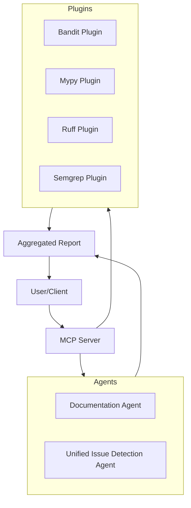

# Multi-Agent MCP Server

[](https://opensource.org/licenses/MIT)
[](https://www.python.org/downloads/)

A production-ready, modular multi-agent server for automated codebase review and documentation. Built with the Model Context Protocol (MCP) for seamless integration with AI development workflows.

## 🚀 Features

- **Multi-Agent Architecture**: Specialized agents for documentation, issue detection, and comprehensive analysis
- **MCP Integration**: Full Model Context Protocol support for AI tool integration
- **Workflow Orchestration**: Advanced DSPy workflow integration
- **Strict Validation**: Comprehensive output validation with Pydantic schemas
- **Production Ready**: Comprehensive testing and professional packaging

## 📋 Table of Contents

- [Installation](#installation)
- [Quick Start](#quick-start)
- [MCP Tools Reference](#mcp-tools-reference)
- [Documentation](#documentation)
- [Development](#development)
- [Contributing](#contributing)
- [License](#license)

## 🛠️ Installation

### Python Package (Recommended)

```bash
# Using uv (recommended)
uv add multiagent-mcp-server

# Using pip
pip install multiagent-mcp-server
```

### From Source

```bash
# Clone the repository
git clone https://github.com/your-org/multi-agent-mcp-server.git
cd multi-agent-mcp-server

# Install with uv
uv sync

# Or with pip
pip install -e .
```

## 🚦 Quick Start

### Start the Server

```bash
# Using the installed package
multiagent-mcp-server

# Or using Python module
python -m multiagent_mcp_server.server
```

## 🧩 MCP Tools Reference

The server exposes agent tools via the Model Context Protocol (MCP), not RESTful HTTP endpoints.

### Available MCP Tools

| Tool Name                  | Description                                      |
|----------------------------|--------------------------------------------------|
| `issue_detection_review`   | Unified code issue detection and analysis         |
| `documentation_generate`   | Generate comprehensive project documentation      |
| `comprehensive_review`     | Run all agents for complete codebase analysis     |

Refer to the MCP documentation for integration details.

## 📖 Documentation

Comprehensive documentation is available in the [`docs/`](docs/) directory:

- **[Getting Started Guide](docs/guides/getting_started.md)** - Quick start tutorial
- **[Architecture Guide](docs/development/architecture.md)** - System architecture overview
- **[Development Guide](docs/development/)** - Development setup and guidelines
- **[Agent Documentation](docs/phases/)** - Agent-specific documentation

## 🏗️ System Architecture



## 🔧 Development

### Prerequisites

- Python 3.10 or higher
- uv or pip for package management

### Setup

```bash
# Clone and setup
git clone https://github.com/your-org/multi-agent-mcp-server.git
cd multi-agent-mcp-server
uv sync

# Install pre-commit hooks
pre-commit install

# Run tests
pytest

# Run with coverage
pytest --cov=src/multiagent_mcp_server
```

### Project Structure

```
multi-agent-mcp-server/
├── src/multiagent_mcp_server/    # Main package
├── docs/                         # Documentation
├── examples/                     # Usage examples
├── tests/                        # Test suite
├── data/                         # Sample data and outputs
└── scripts/                      # Utility scripts
```

## 🤝 Contributing

We welcome contributions! Please see our [Contributing Guide](CONTRIBUTING.md) for details on:

- Development setup
- Code style guidelines
- Testing requirements
- Pull request process

### Quick Contribution Steps

1. Fork the repository
2. Create a feature branch
3. Make your changes
4. Add tests and documentation
5. Submit a pull request

## 📄 License

This project is licensed under the MIT License - see the [LICENSE](LICENSE) file for details.

## 🙏 Acknowledgments

- Built with the [Model Context Protocol](https://modelcontextprotocol.io/)
- Powered by [DSPy](https://github.com/stanfordnlp/dspy)
- Validation with [Pydantic](https://pydantic.dev/)

---

**[📚 Documentation](docs/)** • **[🐛 Issues](https://github.com/your-org/multi-agent-mcp-server/issues)** • **[💬 Discussions](https://github.com/your-org/multi-agent-mcp-server/discussions)**
