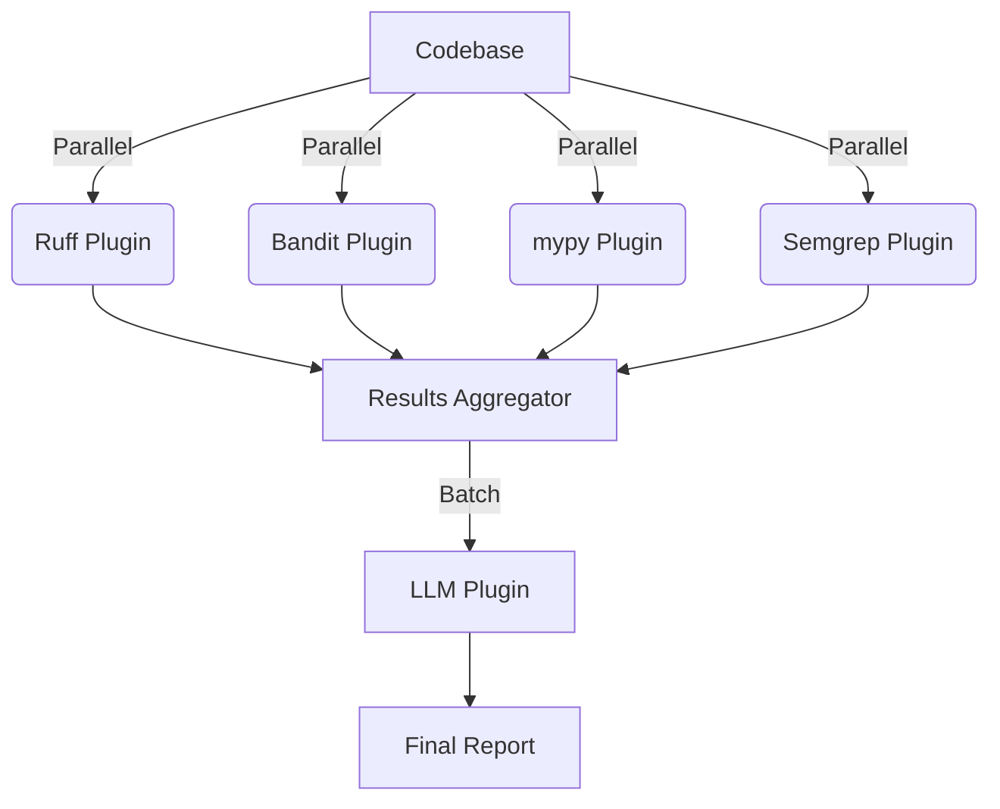

# Modular Static+LLM Code Analysis Architecture

- Plugins are modular and language-agnostic.
- Orchestrator manages plugin execution, aggregation, and config.
- LLM plugin can explain, triage, or propose fixes for findings.
- Caching and batching optimize performance.